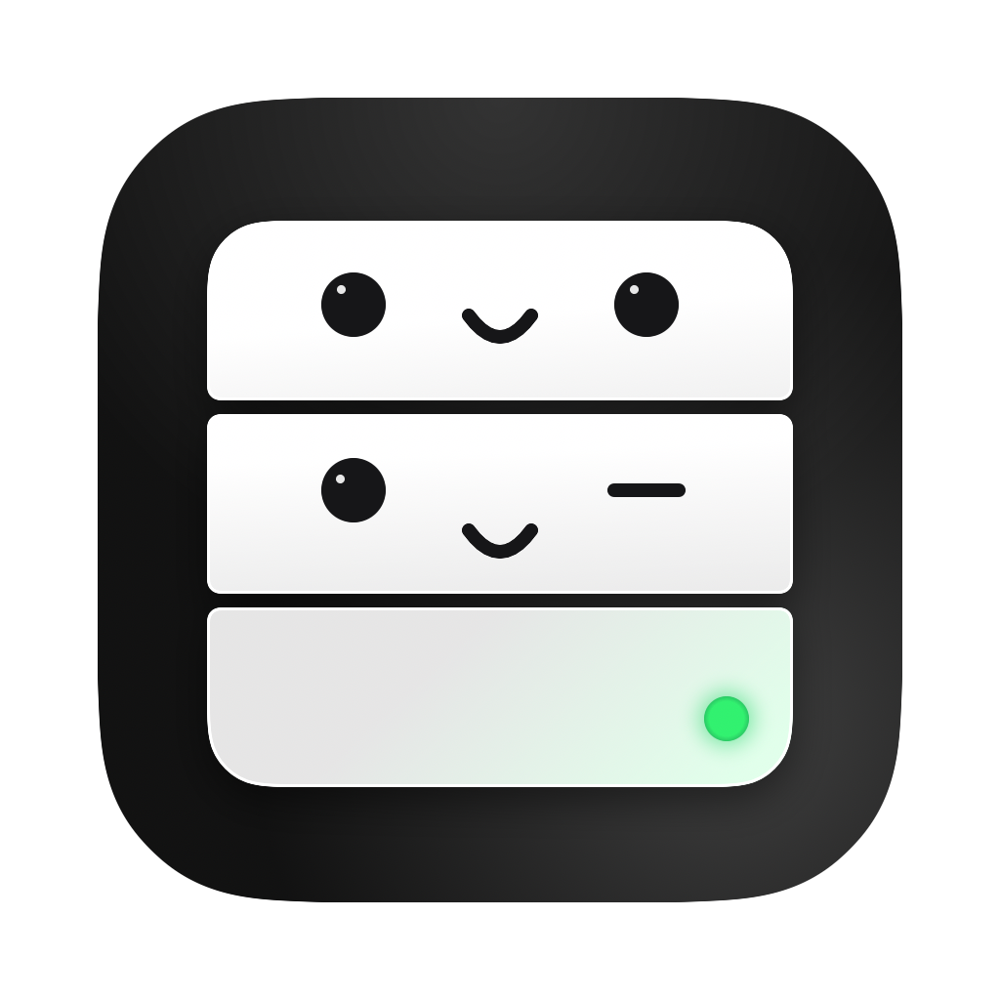

<p align="center"></p>

# Portly

A small macOS menu bar app that shows the local servers running on your Mac, and lets you stop or restart them.

Made for people who start a lot of `npm run dev` servers in different projects (or let Claude Code and other tools start them) and then lose track of what is still running.

## What it does

- **Websites:** servers that answer with a web page (Vite, Next.js, Storybook…). You can open, restart or stop each one.
- **Background:** databases, caches and helper programs with no page to open (PostgreSQL, Redis, MCP helpers…). Each one has a plain description and a note that says if it is safe to stop.
- **Is it in use?** Portly checks which programs are connected to each server right now. A database with no app connected is marked *Safe to stop*. A database that an app is using is marked *Best to keep running*.
- **Clean up:** servers left running after the window or session that started them has closed get a *Clean up* button.
- **Stopped list:** what you stop stays in a list with a *Start* button, so you can turn it on again later.
- **Homebrew services** (like `postgresql` or `redis`) are stopped and started with `brew services`, so they also stay off after a restart of the Mac.
- Liquid Glass panel, and an option to open at login.

## Install

Portly needs **macOS 26 (Tahoe)** or later.

1. Download `Portly.zip` from the [latest release](https://github.com/benoitmasse/portly/releases/latest) and unzip it.
2. Move `Portly.app` to your Applications folder.
3. Open it. The first time, macOS blocks it because it is not signed with a paid Apple Developer ID. To allow it:
   open **System Settings → Privacy & Security**, scroll down, and click **Open Anyway** next to the Portly message.
   Or run this in Terminal:
   ```bash
   xattr -dr com.apple.quarantine /Applications/Portly.app
   ```

Portly appears as a small server with a monocle and a mustache in the menu bar. The number next to it is the number of websites that are running.

## Build it yourself

You need Apple's free Command Line Tools (`xcode-select --install`).

```bash
git clone https://github.com/benoitmasse/portly.git
cd portly
./build.sh --install
```

`./build.sh` only builds `Portly.app`, `--install` also copies it to /Applications, and `--zip` makes `Portly.zip` for a release.

## Good to know

- **Restart** runs the same command again in the same folder, in the background. Its output goes to `~/Library/Logs/Portly/`. It does not keep variables you typed before the command (for example `PORT=3001 npm run dev`). Settings in `.env` files still work.
- If one command starts several servers (for example `turbo dev`), stop and restart act on all of them together.
- Portly only sees programs that run as your user. It never asks for an administrator password.

From a terminal, `Portly.app/Contents/MacOS/Portly --list` prints what Portly sees.

## License

MIT

The icon is designed in Figma and exported as `icon/AppIcon.png` (1024 × 1024, transparent corners). Run `./icon/make-icns.sh` after replacing it. The menu bar icon is `icon/MenuIcon.png`, `@2x` and `@3x` (the "Subtract" layer of that frame, exported 16, 32 and 48 px high).
